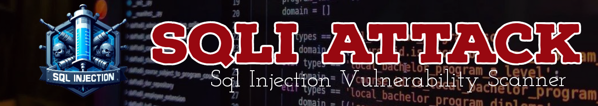

<h1 align="center">
  </a>
  <br>
   
</h1>

<h4 align="center">Pengimbas SQL Injection dibuat dengan python.</h4>


      
<p align="center">
  <a href="#Features">Screenshot</a> •
  <a href="#Penggunaan">Install</a> •
  <a href="#Cara-guna">Usage</a> •
  <a href="http://tengkorakcyber.org/dork.txt">Dork</a> 
</p>

---


Sqli Attack ialah alat dengan fungsi mengesan kelemahan suntikan sql berasaskan GET dalam aplikasi web menggunakan waybackurls, perangkak web dan muatan suntikan sql.


# Screenshot

<h1 align="left">
  </a>
  <br>
</h1>


 - Pengimbas yang pantas dan berkuasa
 - Bersertakan perangkak web dan waybackurls


# Penggunaan

```sh
python3 sqli-attack.py -h
```
Ini akan memaparkan bantuan untuk alat tersebut. Berikut adalah semua suis yang disokongnya.


# Pemasangan

Sqli Attack memerlukan:
- python3
- huepy
- requests
- tqdm

Untuk memasang jalankan arahan ini:
```sh
▶ sudo apt install git
```
```sh
▶ git clone https://github.com/tengkorakcyber/sqliattack
```
```sh
▶ cd sqli-attack
▶ pip3 install -r requirements.txt
```


# Cara-guna

Untuk menjalankan alat pada sasaran, hanya gunakan arahan berikut.
```sh
▶ python3 sqli-attack.py -d example.com
```


Perintah `-s` boleh digunakan untuk menguji suntikan sql dalam subdomain sasaran.

```sh
▶ python3 sqli-attack -d example.com -s
```


# License

Sqli Attack is Recode By [TengkorakCyberCrew](https://tengkorakcyber.org).

